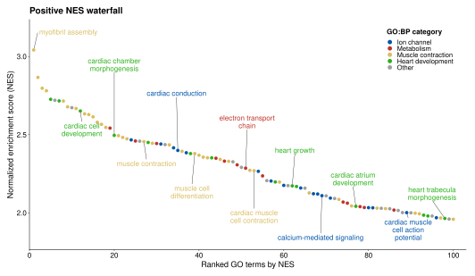
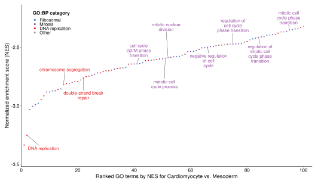
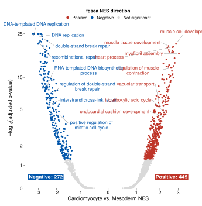
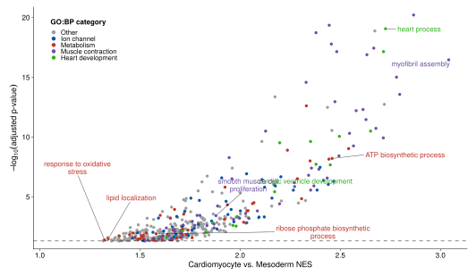
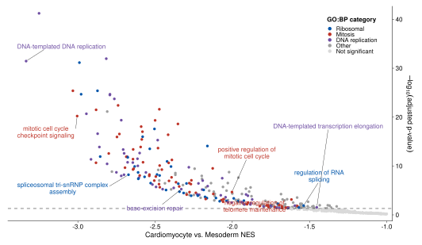
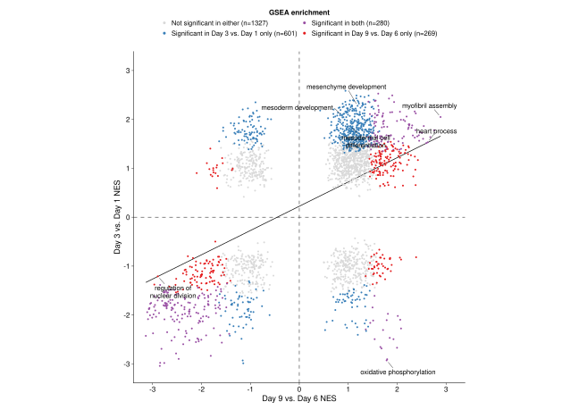

```{r tutorial-options, include=FALSE}
knitr::opts_chunk$set(
  echo = FALSE,
  message = FALSE,
  warning = FALSE,
  fig.align = 'center'
)
```

<div class="tutorial-title-block">
<h1 class="title">Gene set enrichment analysis NES waterfall, volcano, and comparative scatter plots</h1>
<div class="tutorial-subtitle">Standalone R functions for visualizing ranked GO biological-process enrichment results.</div>

<div class="tutorial-meta-block">
<div><span>Author:</span> Zoheb Khan</div>
<div><span>Modified:</span> 2026-08-02</div>
<div><span>Compiled:</span> 2026-08-02</div>
<div><span>Environment:</span> R version 4.6.1 (2026-06-24)</div>
<div><span>Bioconductor:</span> 3.23</div>
<div><span>Source:</span> <a href="https://github.com/ZohebKhan1/gsea-waterfall">GitHub repository</a></div>
</div>
</div>

# Overview

`gsea-waterfall` visualizes **precomputed** Gene Set Enrichment Analysis
(GSEA) results as ranked NES waterfalls, volcano plots, and cross-contrast
comparative NES scatterplots. The functions return `ggplot` objects. They are a
visualization layer applied after GSEA has been performed and do not change
supplied statistics or write files.

The examples use fixed GO biological-process results from the GSE122380
cardiomyocyte iPSC time-course bulk RNA-seq contrasts. Plot controls select,
group, and label displayed rows; significance classes use the explicit
adjusted-p-value cutoff without altering the supplied statistics.

## Example data and preprocessing

The bundled tables are derived from the public [NCBI GEO accession
GSE122380](https://www.ncbi.nlm.nih.gov/geo/query/acc.cgi?acc=GSE122380), a
bulk RNA-seq time course of human iPSC differentiation into cardiomyocytes.
Basic sequencing and sample-level QC was performed before differential
expression analysis. A DESeq2 comparison of day 9 (cardiomyocyte) versus day 3
(mesoderm) generated the cardiomyocyte-versus-mesoderm contrast used for the
bundled GSEA results.

## Use case

GSEA results are commonly shown as running enrichment plots for individual
pathways or as dotplot/barplot-style summaries of a short list of terms. Those
views work well for a focused pathway or compact top-term summary, but they
provide limited room to inspect the broader ranked result.

The waterfall plots are intended for that complementary use case. They allow
roughly 100–200 ranked GO terms to be viewed together, including terms beyond
the usual top 10–20. This can make related parent/child terms and broader
functional patterns visible in the same ranked context. Caller-defined
`term_groups` can organize displayed terms by biological theme; they are
annotations only and do not perform redundancy reduction or additional
statistics.

The visual design was informed by pathway-level figures from Ciceri et al.
(2024), Xu et al. (2025), Vuong et al. (2026), and Risgaard et al. (2026). Full
citations are provided at the end of this tutorial.

# Install and source

Install the plotting dependencies once:

```r
install.packages(c('ggplot2', 'ggrepel', 'scales'))
```

Download and source the consolidated plotting file:

```r
download.file(
  'https://raw.githubusercontent.com/ZohebKhan1/gsea-waterfall/main/functions/gsea_visualizations.R',
  'gsea_visualizations.R')

source('gsea_visualizations.R')
```

This provides `read_gsea_result_csv()`, `plot_gsea_waterfall()`,
`plot_gsea_volcano()`, `plot_gsea_half_volcano()`, and
`plot_gsea_nes_scatter()`.

# Input data

Each table represents one GSEA contrast with one row per unique term. Results
can come from any GSEA workflow, including `fgsea`, `clusterProfiler`, or
another package. The default columns are:

| Column | Required | Meaning |
|:---|:---|:---|
| `go_description` | yes | GO term description and fallback matching key |
| `go_term_id` | no | stable matching key used automatically when present |
| `NES` | yes | normalized enrichment score |
| `pval` | no | optional nominal GSEA p-value; used only for nominal-p-value ranking or y-axes |
| `padj` | yes | adjusted p-value in `[0, 1]` |

`go_description`, `NES`, and `padj` must be complete, and NES values must be finite. If `pval` is supplied, it is also validated. Key precedence is explicit `id_col`, then `go_term_id` when present, otherwise `go_description`. Comparative scatterplots use the exact shared-key intersection and do not impute absent terms.

If your result table uses different column names, map them when reading it:

```r
fgsea_results <- read_gsea_result_csv(
  'fgsea_results.csv',
  term_col = 'pathway',
  nes_col = 'NES',
  padj_col = 'padj'
)
```

For comparative plots, use `id_col` with a stable term identifier whenever one
is available. Without stable IDs, term descriptions must match exactly across
tables.

Load the bundled examples:

```{r input-data-preview, echo=TRUE}
source('../functions/gsea_visualizations.R')

gsea_cardiomyocyte_vs_mesoderm <- read_gsea_result_csv(
  'data/GSE122380_gsea_cardiomyocyte_vs_mesoderm.csv'
)

gsea_day9_vs_day6 <- read_gsea_result_csv(
  'data/GSE122380_gsea_day9_vs_day6.csv'
)

gsea_day3_vs_day1 <- read_gsea_result_csv(
  'data/GSE122380_gsea_day3_vs_day1.csv'
)

print(head(gsea_cardiomyocyte_vs_mesoderm, 5L))
```

# Ranked GSEA waterfall plots

`plot_gsea_waterfall()` selects one NES direction, ranks by `NES` or `padj` by default, and retains `top_n` terms. Nominal-p-value ranking is available when an optional `pval` column is supplied. `term_groups` controls colors and `label_terms` controls labels. Matches are case-insensitive against term descriptions or IDs.

For the example waterfall figures, classifications use caller-defined keyword
groups for ion-channel, metabolic, muscle-contraction, heart-development,
ribosomal, mitotic, and DNA-replication terms; unmatched terms remain `Other`.

## Positive NES waterfall

```r
gsea_cardiomyocyte_vs_mesoderm <- read_gsea_result_csv(
  'tutorial/data/GSE122380_gsea_cardiomyocyte_vs_mesoderm.csv'
)

positive_term_groups <- list(
  'Cardiac development' = c('cardiac', 'heart', 'muscle'),
  'Metabolism' = c('mitochondrial', 'metabolic', 'oxidative')
)

positive_waterfall_plot <- plot_gsea_waterfall(
  gsea_results = gsea_cardiomyocyte_vs_mesoderm,
  direction = 'positive',
  top_n = 100L,
  rank_by = 'NES',
  label_n = 12L,
  term_groups = positive_term_groups
)
```

`direction` chooses the NES side to display. `top_n` is applied after that
filter and after ranking. Terms are neutral unless `term_groups` is supplied;
each seed is matched case-insensitively against term IDs or descriptions.

```{r positive-waterfall-figure, results='asis', out.width='80%', fig.alt='Positive NES waterfall for Cardiomyocyte versus Mesoderm'}
cat('<div id="fig-positive-waterfall" class="figure-anchor"></div>\n')


```

<div class="tutorial-figure-caption"><strong>Figure 1.</strong> Positive NES terms ranked by NES, with selected term groups and labels.</div>

## Negative NES waterfall

```r
gsea_cardiomyocyte_vs_mesoderm <- read_gsea_result_csv(
  'tutorial/data/GSE122380_gsea_cardiomyocyte_vs_mesoderm.csv'
)

negative_term_groups <- list(
  'Ribosomal' = c('ribosome', 'ribosomal', 'spliceosomal', 'rRNA', 'RNA'),
  'Mitosis' = c(
    'Mitosis', 'Meiosis', 'Nuclear division', 'cell cycle', 'telomere',
    'spindle', 'Mitotic', 'Meiotic'),
  'DNA replication' = c('chromosome', 'DNA', 'base', 'repair', 'DNA-'))

negative_waterfall_label_terms <- c(
  'DNA replication',
  'rRNA processing',
  'chromosome segregation',
  'double-strand break repair',
  'cell cycle G2/M phase transition',
  'maturation of 5.8S rRNA',
  'mitotic nuclear division',
  'regulation of cell cycle phase transition',
  'regulation of mitotic cell cycle phase transition',
  'spliceosomal complex assembly')

negative_waterfall_plot <- plot_gsea_waterfall(
  gsea_results = gsea_cardiomyocyte_vs_mesoderm,
  direction = 'negative',
  top_n = 100L,
  rank_by = 'NES',
  label_terms = negative_waterfall_label_terms,
  term_groups = negative_term_groups
)
```

Use `rank_by = 'padj'` when adjusted-p-value ranking, rather than NES magnitude,
should determine the displayed order. `rank_by = 'pvalue'` is available when an
optional nominal `pval` column is supplied. `label_n` selects labels
automatically when exact terms are not supplied; use `label_terms` when
specific terms should be shown.

```{r negative-waterfall-figure, results='asis', out.width='80%', fig.alt='Negative NES waterfall for Cardiomyocyte versus Mesoderm'}
cat('<div id="fig-negative-waterfall" class="figure-anchor"></div>\n')


```

<div class="tutorial-figure-caption"><strong>Figure 2.</strong> Negative NES terms ranked by NES, with caller-defined ribosomal, mitotic, and DNA-replication term groups.</div>

# Volcano plots

Use `plot_gsea_volcano()` for both NES directions in one panel and `plot_gsea_half_volcano()` for a directional view. All examples use the established adjusted p-value cutoff of 0.05.

## Symmetric volcano

The example labels eight padj-significant terms across each NES direction, from
approximately NES 2 to the most extreme observed value. The same terms are
used in the directional half-volcano plots.

```r
negative_volcano_label_terms <- c(
  'DNA-templated DNA replication',
  'DNA replication',
  'recombinational repair',
  'double-strand break repair',
  'RNA-templated DNA biosynthetic process',
  'interstrand cross-link repair',
  'regulation of double-strand break repair',
  'positive regulation of mitotic cell cycle')

positive_volcano_label_terms <- c(
  'vacuolar transport',
  'endocardial cushion development',
  'tricarboxylic acid cycle',
  'muscle tissue development',
  'regulation of muscle contraction',
  'heart process',
  'muscle cell development',
  'myofibril assembly')

volcano_label_terms <- c(
  negative_volcano_label_terms,
  positive_volcano_label_terms)
```

```r
symmetric_volcano_plot <- plot_gsea_volcano(
  gsea_results = gsea_cardiomyocyte_vs_mesoderm,
  padj_cutoff = 0.05,
  label_terms = volcano_label_terms,
  contrast_label = 'Cardiomyocyte vs. Mesoderm'
)
```

`padj_cutoff` controls significance coloring and the displayed counts. It does
not remove rows from the plot. Use `label_terms` instead of `label_n` when you
want to label exact terms.

```{r symmetric-volcano-figure, results='asis', out.width='58%', fig.alt='Symmetric GSEA volcano for Cardiomyocyte versus Mesoderm'}
cat('<div id="fig-symmetric-volcano" class="figure-anchor"></div>\n')


```

<div class="tutorial-figure-caption"><strong>Figure 3.</strong> Symmetric NES volcano colored by adjusted-p-value significance and direction.</div>

## Directional half-volcano plots

```r
positive_half_volcano_plot <- plot_gsea_half_volcano(
  gsea_results = gsea_cardiomyocyte_vs_mesoderm,
  direction = 'positive',
  p_col = 'padj',
  padj_cutoff = 0.05,
  label_terms = positive_volcano_label_terms,
  term_groups = positive_term_groups,
  inner_nes_limit = 1,
  contrast_label = 'Cardiomyocyte vs. Mesoderm'
)
```

`inner_nes_limit = 1` keeps terms with positive NES at least 1 in magnitude.
Set `p_col = 'pvalue'` to show nominal p-values when the optional `pval` column
is supplied; significance coloring continues to use `padj_cutoff`.

```{r positive-half-volcano-figure, results='asis', out.width='72%', fig.alt='Positive NES half-volcano for Cardiomyocyte versus Mesoderm'}
cat('<div id="fig-positive-half-volcano" class="figure-anchor"></div>\n')


```

<div class="tutorial-figure-caption"><strong>Figure 4.</strong> Positive NES half-volcano with caller-defined term groups and labels.</div>

```r
negative_half_volcano_plot <- plot_gsea_half_volcano(
  gsea_results = gsea_cardiomyocyte_vs_mesoderm,
  direction = 'negative',
  p_col = 'padj',
  padj_cutoff = 0.05,
  label_terms = negative_volcano_label_terms,
  term_groups = negative_term_groups,
  inner_nes_limit = 1,
  contrast_label = 'Cardiomyocyte vs. Mesoderm'
)
```

```{r negative-half-volcano-figure, results='asis', out.width='72%', fig.alt='Negative NES half-volcano for Cardiomyocyte versus Mesoderm'}
cat('<div id="fig-negative-half-volcano" class="figure-anchor"></div>\n')


```

<div class="tutorial-figure-caption"><strong>Figure 5.</strong> Negative NES half-volcano with caller-defined term groups and labels.</div>

# Comparative NES scatterplot

`plot_gsea_nes_scatter()` compares exact shared term keys. By default it keeps
terms significant in at least one contrast and does not draw a fitted line. The
line is descriptive when requested and does not alter enrichment statistics.

```r
nes_scatter_plot <- plot_gsea_nes_scatter(
  gsea_x = gsea_day9_vs_day6,
  gsea_y = gsea_day3_vs_day1,
  x_label = 'Day 9 vs. Day 6 NES',
  y_label = 'Day 3 vs. Day 1 NES',
  color_by = 'significance',
  quadrant = 'all',
  x_name = 'Day 9 vs. Day 6',
  y_name = 'Day 3 vs. Day 1',
  label_n_x_only = 3L,
  label_n_y_only = 3L,
  label_n_both = 3L,
  padj_cutoff = 0.05,
  include_nonsignificant = TRUE,
  equal_axis_limits = TRUE,
  show_fit_line = TRUE
)
```

```{r all-quadrants-scatter-figure, results='asis', out.width='100%', fig.alt='Comparative NES scatterplot for Day 9 versus Day 6 and Day 3 versus Day 1'}
cat('<div id="fig-all-quadrants-scatter" class="figure-anchor"></div>\n')


```

<div class="tutorial-figure-caption"><strong>Figure 6.</strong> Shared terms colored by significance in one, both, or neither contrast.</div>

Set `include_nonsignificant = FALSE` to focus on terms significant in at least
one contrast. Use `quadrant = 'q1'` or `quadrant = 'q3'` to focus on concordant
positive or negative NES values. `equal_axis_limits = TRUE` makes the two NES
axes directly comparable.

# API summary

| Function | Contract |
|:---|:---|
| `read_gsea_result_csv()` | reads and validates one precomputed CSV without filtering rows |
| `plot_gsea_waterfall()` | returns a ranked one-direction ggplot |
| `plot_gsea_volcano()` | returns a symmetric NES-versus-adjusted-p-value ggplot |
| `plot_gsea_half_volcano()` | returns a directional ggplot after the explicit NES boundary |
| `plot_gsea_nes_scatter()` | returns a ggplot from the exact shared term-key intersection |

Source documentation defines the complete argument contracts, including the common `term_col`, `nes_col`, `padj_col`, and optional `id_col` arguments. Nominal-p-value mapping is only needed when using the optional `pval`-based controls.

# References

<ol class="reference-list">
<li>Subramanian A, Tamayo P, Mootha VK, et al. Gene set enrichment analysis: a knowledge-based approach for interpreting genome-wide expression profiles. <em>PNAS</em>. 2005. <a href="https://www.pnas.org/doi/10.1073/pnas.0506580102">https://www.pnas.org/doi/10.1073/pnas.0506580102</a></li>
<li>Ciceri G, Baggiolini A, Cho HS, et al. An epigenetic barrier sets the timing of human neuronal maturation. <em>Nature</em>. 2024;626:881-890. <a href="https://doi.org/10.1038/s41586-023-06984-8">https://doi.org/10.1038/s41586-023-06984-8</a></li>
<li>Xu N, Cho HS, Hackland JOS, et al. Genome-wide CRISPR screen identifies Menin and SUZ12 as regulators of human developmental timing. <em>Nature Cell Biology</em>. 2025;27:1411-1421. <a href="https://doi.org/10.1038/s41556-025-01751-5">https://doi.org/10.1038/s41556-025-01751-5</a></li>
<li>Vuong CK, Weber A, Seong P, et al. A single-cell multiomic analysis identifies molecular and gene-regulatory mechanisms dysregulated in developing Down syndrome neocortex. <em>Science</em>. 2026;392:eaea1259. <a href="https://doi.org/10.1126/science.aea1259">https://doi.org/10.1126/science.aea1259</a></li>
<li>Risgaard RD, et al. Molecular and cellular processes disrupted in the early postnatal Down syndrome prefrontal cortex. <em>Science</em>. 2026;392:eaea1549. <a href="https://doi.org/10.1126/science.aea1549">https://doi.org/10.1126/science.aea1549</a></li>
</ol>
